## Automate the React Application Deployment to cPanel with GitHub Actions.

Deploying a React application to cPanel can be streamlined using GitHub Actions. This guide will walk you through the steps to set up an automated deployment process based on the environment.

### Prerequisites
- A React application hosted in a GitHub repository.
- Access to a cPanel account with SSH access enabled.
- SSH keys set up for secure access to your cPanel server.

### Flow Diagram
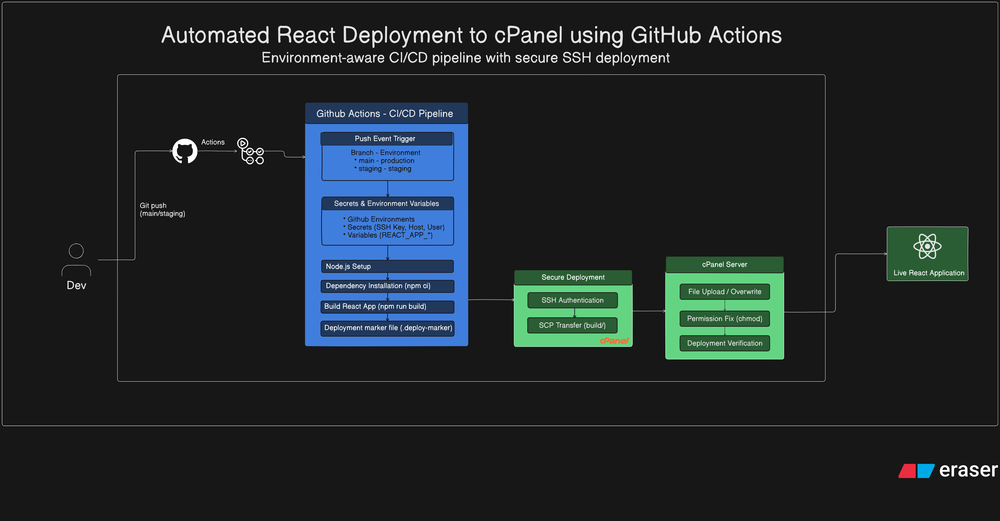

### Step 1: Generate SSH Keys
If you haven't already, enable the SSH access in your cPanel account and generate SSH keys. You can do this via the cPanel interface under "SSH Access".

1. Log in to your cPanel account.
2. Navigate to "SSH Access" and click on "Manage SSH Keys".
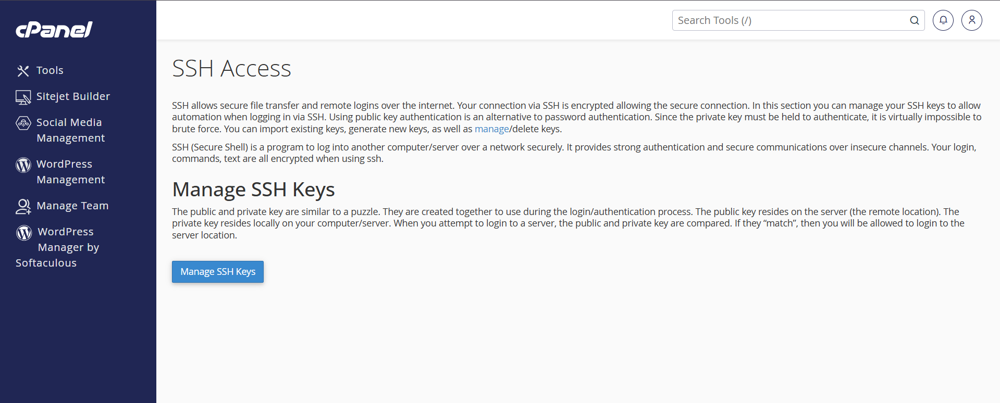
3. Generate a new key pair and download the private key to your local machine.
4. Authorize the public key in cPanel.
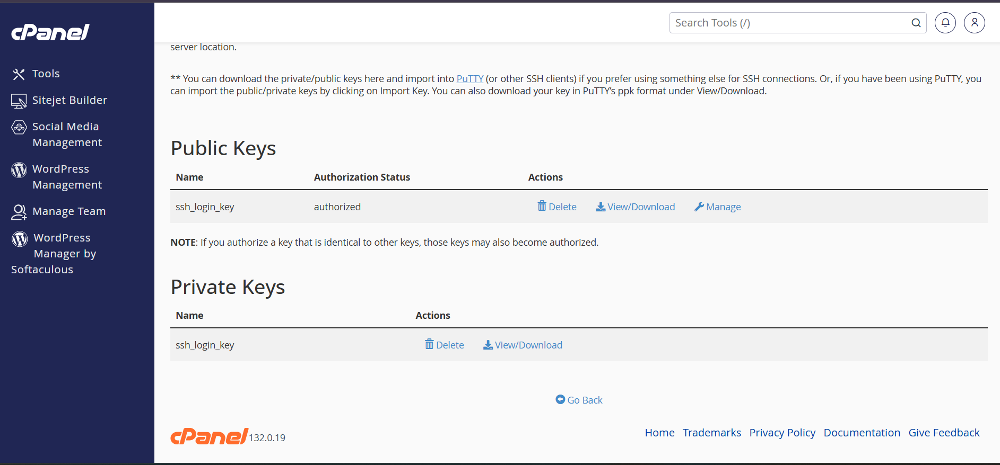
5. We need to have the private key in a format compatible with GitHub Actions.
6. Open PuTTYgen (if using Windows) or use the terminal (if using macOS/Linux) to convert the private key to OpenSSH format without any passphrase for automation.
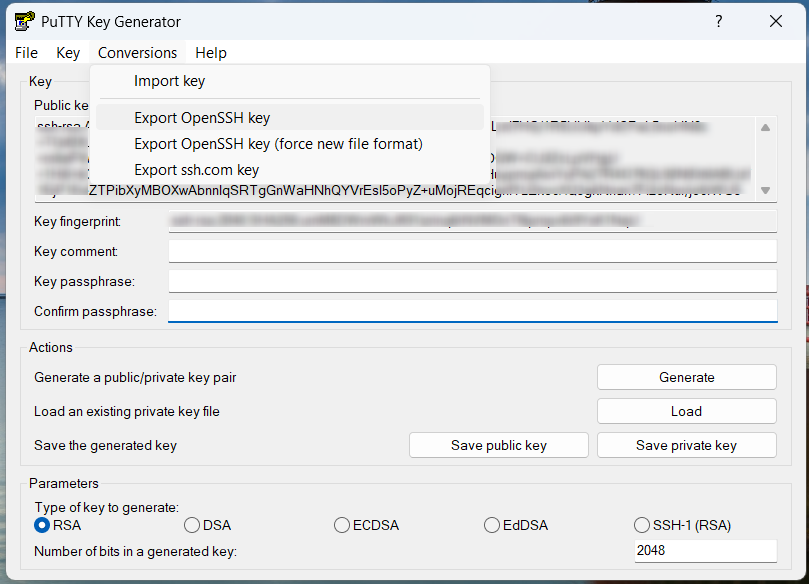
7. Copy the contents of the private key file.

### Step 2: Add Username, Host and SSH Key to GitHub Secrets
Secrets are used to store sensitive information securely in GitHub. These are encrypted environment variables that can be used in your GitHub Actions workflows. Once added, they can be referenced in your workflow files without exposing the actual values. note that GitHub Secrets are repository-specific, so you'll need to add them to each repository where you want to use them.

1. Go to your GitHub repository.
2. Navigate to "Settings" > "Secrets and variables" > "Actions".
3. Click on "New repository secret".
4. Add the following secrets:
   - `CPANEL_SSH_USERNAME`: Your cPanel SSH username.
   - `CPANEL_SSH_HOST`: Your cPanel server hostname (e.g., example.com).
   - `CPANEL_SSH_PRIVATE_KEY`: Paste the contents of your private key file here.
    - `CPANEL_SSH_PORT`: (Optional) The SSH port if it's not the default 22.
5. Save each secret.
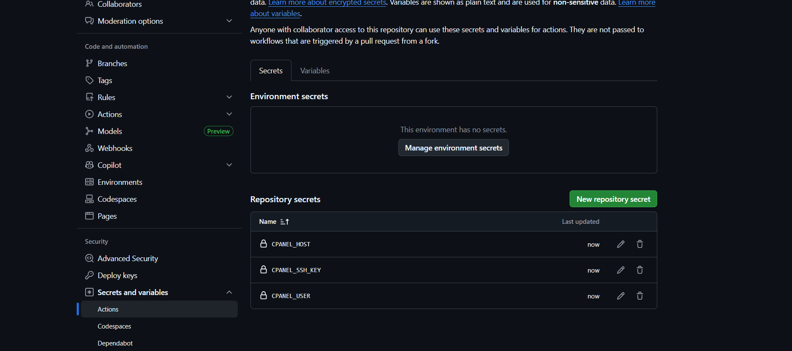

### Step 3: Create Environments in GitHub
1. In your GitHub repository, go to "Settings" > "Environments".
2. Create two environments: `staging` and `production`.
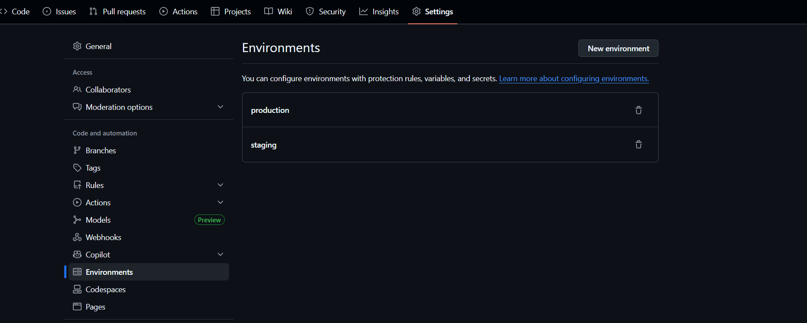

### Step 4: Add Environment Secrets for Deployment Paths
Cpanel deployments often require different paths for staging and production.

1. For the `staging` environment, add a secret named `CPANEL_DEPLOY_PATH` with the path to your staging directory (e.g., `/home/username/public_html/staging`).
2. For the `production` environment, add a secret named `CPANEL_DEPLOY_PATH` with the path to your production directory (e.g., `/home/username/public_html`).

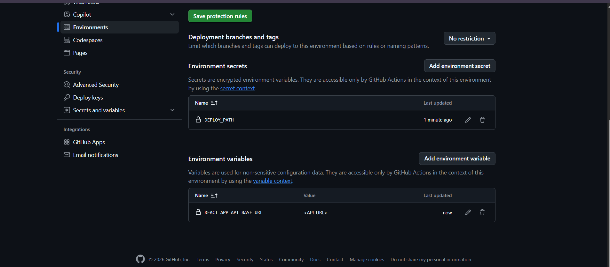

### Step 5: Add Environment Variables for needed for React Build
If your React application requires specific environment variables during the build process, you can add them to each environment in GitHub.
Environment variables can be used to configure your application for different environments (e.g., API endpoints, feature flags). These are not sensitive like secrets but are still important for the build process.


1. In the `staging` environment, add any necessary environment variables (e.g., `REACT_APP_API_BASE_URL`).
2. Repeat the process for the `production` environment with the appropriate values.

### Step 6: React Application Requirements
Ensure your React application has a `build` script defined in the `package.json` file. This script is used to create an optimized production build of your application.

```json
"scripts": {
  "start": "react-scripts start",
  "build": "react-scripts build",
  "test": "react-scripts test",
  "eject": "react-scripts eject"
}
```
Make sure to maintain consistent versions in your `package.json` and `package-lock.json` for dependencies to avoid build issues.

dry-run the build process locally using:
```bash
npm ci --dry-run # Dry run to verify dependencies
npm run build # Create the production build
```

### Step 7: Create GitHub Actions Workflow
Create a GitHub Actions workflow file in your repository to automate the deployment process.

1. In your GitHub repository, create a directory named `.github/workflows` if it doesn't already exist.
2. Inside the `workflows` directory, create a file named `deploy.yml` or any other name you prefer.
3. Add the following content to yml file:

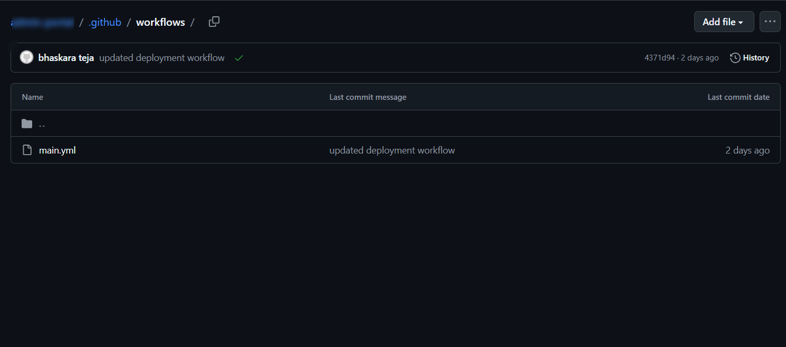

```yaml 

# Automation workflow name
name: Deploy React app to cpanel

# Trigger the workflow on push to main or staging branches
on:
    push:
        branches:
            - main
            - staging

# Define the jobs to be run in the workflow. if the commit message contains [skip deploy], the deployment will be skipped.
jobs:
    deploy: 
        runs-on: ubuntu-latest
        if: |
            !contains(github.event.head_commit.message, '[skip deploy]')

        # Set the environment
        environment: ${{ github.ref_name == 'main' && 'prod' || 'staging' }}

        # Define deployment steps
        steps:
            # Checkout the repository
            - name: Checkout code
              uses: actions/checkout@v4

            # Set up Node.js 
            - name: Setup Node
              uses: actions/setup-node@v4
              with:
                  node-version: 18

            # Install dependencies
            - name: Install dependencies
              run: npm ci

            # Build the React application (Use environment variables from GitHub Environments)
            # Use the environment variables defined in the GitHub environment for the build process
            # CI=false to prevent React from treating the build as a CI environment which can cause warnings/errors
            - name: Build React app
              env: 
                REACT_APP_API_BASE_URL: ${{ vars.REACT_APP_API_BASE_URL }}
                REACT_APP_FAV_ICON: ${{ vars.REACT_APP_FAV_ICON }}
              run: |
                    echo "Bulding react app with API URL: $REACT_APP_API_BASE_URL"
                    CI=false npm run build

            # Create Deployment Marker File for Verification
            - name: Create Deployment marker file
              run: |
                    echo "${GITHUB_SHA}" > build/.deploy-marker

            # Deploy to cPanel via SSH (Uses secrets that are defined in the repository settings)
            - name: Check and Prepare Deployment Directory
              uses: appleboy/ssh-action@v1.0.3
              with:
                  host: ${{ secrets.CPANEL_HOST }}
                  username: ${{ secrets.CPANEL_USER }}
                  key: ${{ secrets.CPANEL_SSH_KEY }}
                  script: |
                      DEPLOY_PATH="/home/${{ secrets.CPANEL_USER }}/${{ secrets.DEPLOY_DIR }}"
                      if [ ! -d "$DEPLOY_PATH" ]; then
                          mkdir -p "$DEPLOY_PATH"
                          echo "Created deployment directory: $DEPLOY_PATH"
                      else
                          echo "Deployment directory exists: $DEPLOY_PATH"
                      fi

            # Upload built files to cPanel (build folder)
            - name: Upload files to cPanel
              uses: appleboy/scp-action@v0.1.7
              with:
                  username: ${{ secrets.CPANEL_USER }}
                  host: ${{ secrets.CPANEL_HOST }}
                  key: ${{ secrets.CPANEL_SSH_KEY }}
                  source: build/*
                  target: "/home/${{ secrets.CPANEL_USER }}/${{ secrets.DEPLOY_DIR }}"

            # Verify Deployment using the marker file
            - name: Check Deployment
              uses: appleboy/ssh-action@v0.1.7
              with:
                  username: ${{ secrets.CPANEL_USER }}
                  host: ${{ secrets.CPANEL_HOST }}
                  key: ${{ secrets.CPANEL_SSH_KEY }}
                  script: |
                      DEPLOY_PATH="/home/${{ secrets.CPANEL_USER }}/${{ secrets.DEPLOY_DIR }}"
                      MARKER_FILE="$DEPLOY_PATH/build/.deploy-marker"
                      if [ -f "$MARKER_FILE" ] && grep -q "${GITHUB_SHA}" "$MARKER_FILE"; then
                          echo "Deployment successful. Files are present in $DEPLOY_PATH"
                      else
                          echo "Deployment Failed. No files found in $DEPLOY_PATH"
                          exit 1
                      fi

            # Set Correct Permissions on Deployed Files
            - name: Fix Permissions
              uses: appleboy/ssh-action@v0.1.7
              with:
                  username: ${{ secrets.CPANEL_USER }}
                  host: ${{ secrets.CPANEL_HOST }}
                  key: ${{ secrets.CPANEL_SSH_KEY }}
                  script: |
                      DEPLOY_PATH="/home/${{ secrets.CPANEL_USER }}/${{ secrets.DEPLOY_DIR }}"
                      if [ -d "$DEPLOY_PATH" ] && [ ! -z "$DEPLOY_PATH" ] && [ "$DEPLOY_PATH" != "/home//" ]; then
                          chmod -R 755 "$DEPLOY_PATH"
                          echo "Permissions Fixed"
                          echo "Deployment Completed"
                      else
                          echo "Error: Invalid deployment path- $DEPLOY_PATH"
                          echo "Deployment Failed"
                          exit 1
                      fi

```

### Step 8: Commit and Push the Workflow
1. Commit the `deploy.yml` file to your repository.
2. Push the changes to GitHub.

```bash
git add .github/workflows/deploy.yml    
git commit -m "Add deployment workflow"
git push origin main
```

### Step 9: Test the Deployment
1. Make a change to your React application and push it to the `staging` branch to test the staging deployment.
2. Once verified, merge the changes to the `main` branch to trigger the production deployment.

```bash
git checkout staging
# Make changes to your React app
git add .
git commit -m "Test deployment to staging"
git push origin staging
# After verification, merge to main
git checkout main
git merge staging
git push origin main
```

### Step 10: Monitor the Workflow
1. Go to the "Actions" tab in your GitHub repository to monitor the workflow runs.
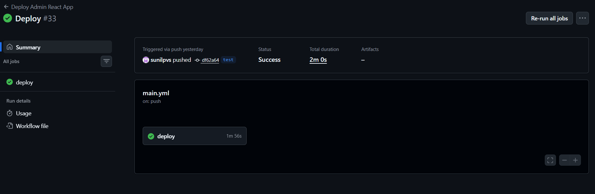
2. Check the logs for any errors and ensure that the deployment completes successfully.
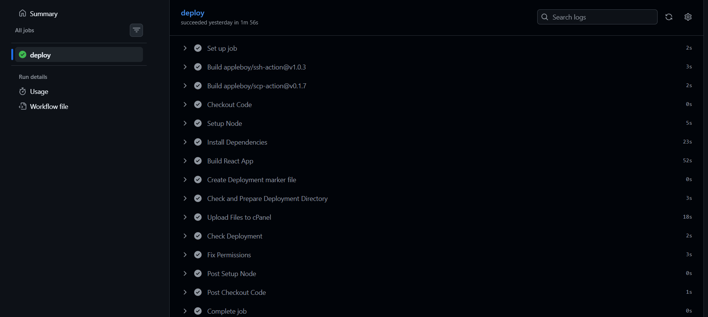
3. Verify that the React application is accessible in the respective cPanel directories.
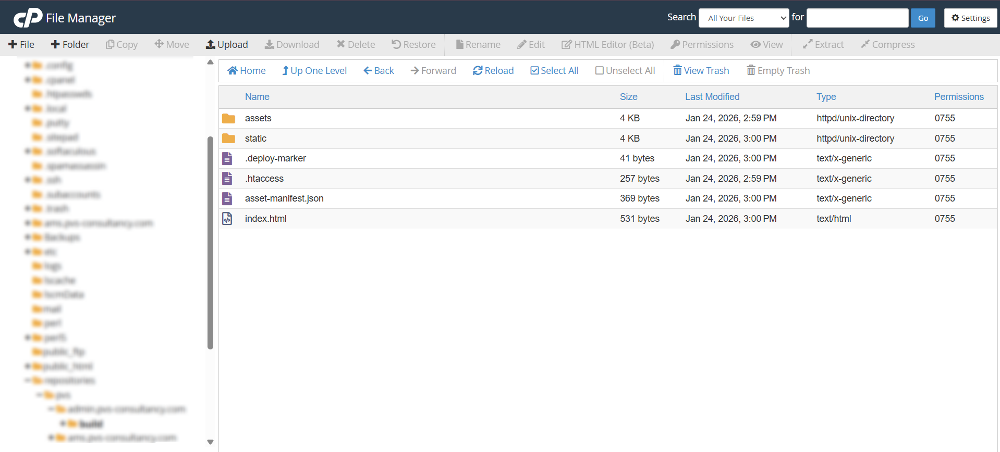
4. Go to website and verify the deployment.
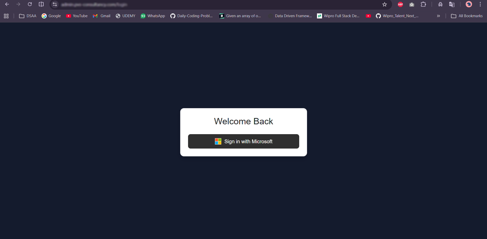

### Future Enhancements
- Notify team members on deployment status via Slack or email.
- Implement rollback mechanisms in case of deployment failures.
- Add notifications (e.g., email, Slack) for deployment status.
- Implement Zero-downtime deployments using symlinks or staging directories.
- Maintain multiple versions of the application for quick rollbacks.


### Conclusion
By following these steps, you have successfully set up an automated deployment process for your React application to cPanel using GitHub Actions. This setup ensures that your application is consistently deployed to the correct environment with minimal manual intervention. Happy deploying!


